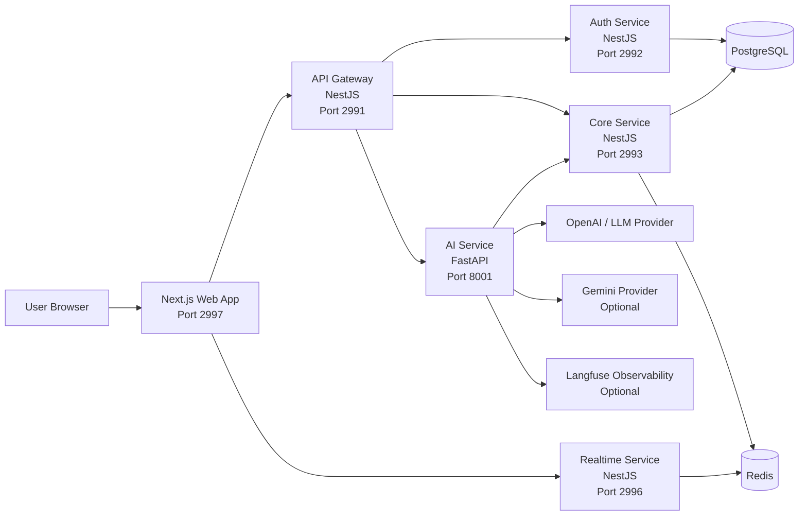
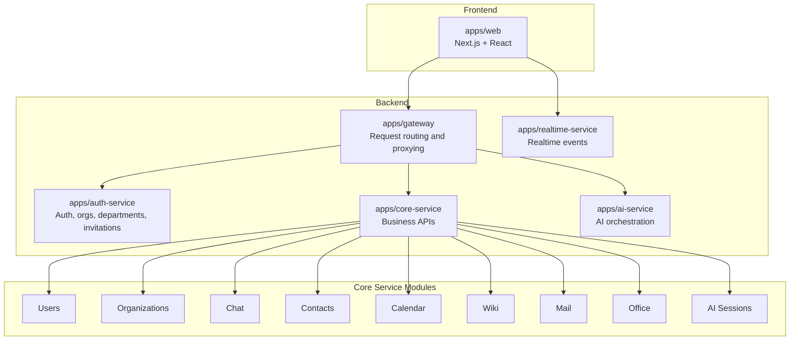
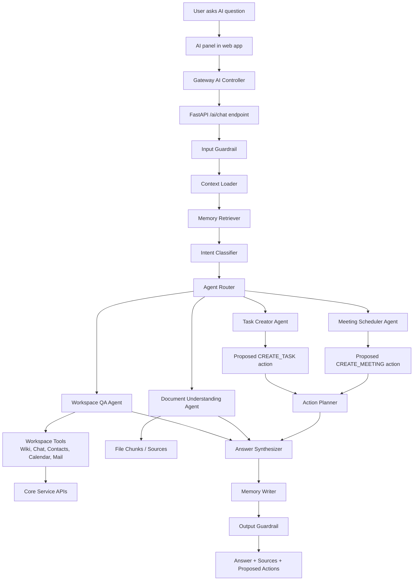
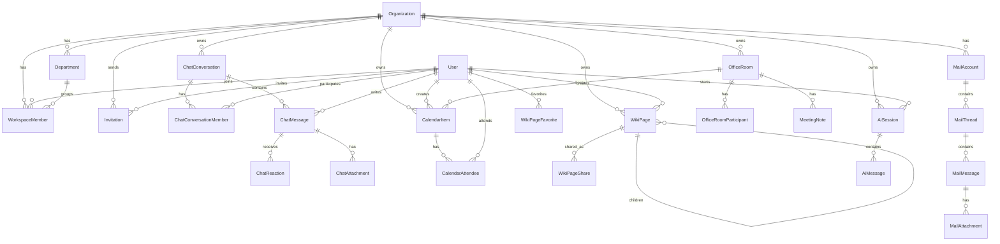
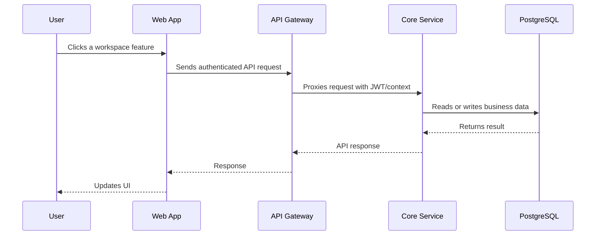
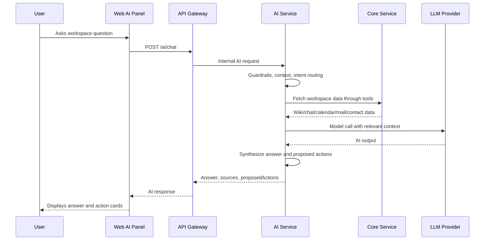

# Serenity Project Description Sheet

This Markdown file is a source document for writing a formal report. It describes the Serenity project, its architecture, technologies, AI usage, and business value.

## 1. Project Overview

Serenity is a full-stack digital workspace platform for organizations and teams. The goal of the system is to combine common office collaboration tools into one workspace: authentication, organization management, departments, chat, contacts, calendar, wiki documentation, mail, virtual office rooms, realtime updates, and an AI assistant.

The project is built as an Nx monorepo. It contains multiple applications that work together as a distributed system:

- Web frontend: user interface built with Next.js and React.
- API Gateway: the public backend entry point for frontend requests.
- Auth Service: authentication, registration, organization setup, departments, and invitations.
- Core Service: main business APIs for chat, contacts, calendar, wiki, mail, office rooms, users, organizations, and AI session persistence.
- Realtime Service: realtime event delivery using Redis.
- AI Service: FastAPI service that runs the AI assistant, document understanding, AI orchestration, guardrails, and action proposals.
- PostgreSQL: main relational database.
- Redis: realtime pub/sub infrastructure.

The application is designed for a business or organization that wants a unified internal workspace instead of using separate tools for chat, calendar, documentation, contacts, email, and meeting collaboration.

## 2. Main Features

### User And Organization Management

- User registration and login.
- JWT-based authentication.
- Organization creation and lookup by slug.
- Workspace membership with roles: OWNER, ADMIN, MEMBER.
- Department management.
- Invitation flow for joining an organization.
- Member role and department updates.

### Chat And Collaboration

- Public channels.
- Private channels.
- Direct messages.
- Conversation member management.
- Message list and message creation.
- Message editing, unsending, and deletion.
- Inline replies and threaded replies.
- Emoji reactions.
- File and GIF attachment metadata.
- Realtime-ready message events through Redis-backed services.

### Contacts

- Employee, guest, and AI-agent contact types.
- Active, invited, and archived statuses.
- Contact metadata such as display name, email, phone, company, title, department, and notes.
- Organization-level filtering and department relationship.

### Calendar And Tasks

- Calendar items can be events, meetings, or tasks.
- Company-level or personal visibility.
- Start and end dates for events/meetings.
- Due dates and TODO/DONE status for tasks.
- Attendee management.
- Room association for meetings.
- Optional linked wiki page for meeting notes or supporting content.

### Wiki / Knowledge Base

- Workspace, department, and private wiki pages.
- Parent-child page tree.
- Markdown and JSON content storage.
- Favorites and recently viewed pages.
- Sharing with permissions: VIEW, COMMENT, EDIT.
- Soft delete support through `deletedAt`.

### Mail

- Google mail account connection support.
- Mail accounts, threads, messages, and attachments stored in the database.
- Thread list and detail APIs.
- Send, reply, forward, and thread action APIs.
- Webhook endpoint for Google Pub/Sub integration.

### Office Rooms

- Virtual office room creation and management.
- Room types: OPEN, PRIVATE, FOCUS, SOCIAL.
- Room capacity and position metadata.
- Join and leave room APIs.
- Meeting notes per room.
- Room token endpoint for realtime/meeting integration.

### AI Assistant

- AI chat sessions and messages are stored in the core database.
- AI service handles chat, file indexing, file question-answering, and action proposals.
- Workspace-aware AI can answer questions using wiki, chat, contacts, calendar, and mail tools.
- AI can propose actions such as creating tasks, meetings, room bookings, and wiki pages.
- Proposal-first design: AI suggests actions, but does not directly mutate core business state without confirmation.

## 3. High-Level Architecture



### Architecture Explanation

The web frontend communicates mainly with the API Gateway. The Gateway hides the internal service structure from the browser and forwards authenticated requests to the correct backend service. Authentication and organization setup are handled by the Auth Service. Most product features are handled by the Core Service. Realtime event delivery is separated into the Realtime Service, which uses Redis. AI functionality is separated into a Python FastAPI service because the AI ecosystem, LangChain, LangGraph, and model integrations are stronger in Python.

PostgreSQL is the source of truth for persistent business data. Redis is used for realtime messaging infrastructure. External AI providers are only accessed from the AI Service, keeping AI concerns isolated from the main business services.

## 4. Service Architecture



## 5. AI Architecture



### AI Runtime Design

The AI Service is implemented with FastAPI, LangChain, and LangGraph. The graph-based runtime contains these steps:

1. Input guardrail checks whether the user request is safe to process.
2. Context loader enriches the request with selected workspace context, such as a wiki page.
3. Memory retriever loads remembered user or workspace context.
4. Intent classifier detects what the user wants.
5. Router sends the task to the correct domain agent.
6. Domain agents query workspace tools or propose structured actions.
7. Action planner collects proposed actions.
8. Synthesizer creates the final answer.
9. Memory writer stores useful memories.
10. Output guardrail validates the final response before returning it.

The AI response can include:

- A natural-language answer.
- Source references.
- Proposed actions.
- A trace ID for observability.
- Thread ID for conversation continuity.

## 6. How AI Is Applied In The Application

AI is applied as a workspace assistant, not just as a generic chatbot. It is connected to organization data and can reason about the user's work context.

### Workspace Question Answering

The AI can use tools for:

- Wiki pages: list pages, search pages, get page content.
- Chat: list conversations, search messages, search all messages.
- Contacts: list and search contacts.
- Calendar: list and search events/tasks/meetings.
- Mail: list mail accounts, list threads, search threads, get thread details.

This allows users to ask questions such as:

- "What did we decide in the last meeting?"
- "Find the wiki page about onboarding."
- "Who is responsible for this client?"
- "What meetings do I have this week?"
- "Summarize recent emails from a customer."

### Document Understanding

The AI Service supports file indexing and file question-answering:

- `/ai/files/index`: accepts file metadata and text/pages, then indexes document chunks.
- `/ai/files/ask`: answers a question using indexed file content and returns sources.

This helps users understand long documents without manually reading every page.

### Proposed Actions

The system uses a proposal-first AI design. The AI may propose actions but should not directly change business data without confirmation.

Supported proposed action types:

- `CREATE_TASK`
- `CREATE_MEETING`
- `BOOK_ROOM`
- `CREATE_WIKI_PAGE`

This design is safer for business software because users stay in control. The AI can help prepare structured work, but human confirmation remains required before important changes.

### AI Memory

The AI runtime includes memory retrieval and memory writing. This allows future conversations to reuse relevant user or workspace context. In the current implementation, runtime memory is kept in service state, while the project also includes Postgres-backed memory hooks and dependencies for future persistent memory expansion.

### Guardrails

The AI pipeline includes input and output guardrails:

- Input guardrail: checks whether the user request should be processed.
- Output guardrail: checks whether the generated response is safe before returning it.

Guardrails are important because the AI assistant has access to workspace context and may generate action proposals.

### Observability

The AI Service includes Langfuse integration hooks. The system can attach metadata such as organization ID, user ID, session ID, thread ID, entrypoint, agent name, and file IDs to traces. This helps debug AI behavior and monitor quality.

## 7. AI Business Value

The AI assistant helps the business in several ways:

- Reduces time spent searching across chat, wiki, calendar, contacts, and mail.
- Helps employees understand internal knowledge faster.
- Converts natural language into structured work proposals, such as tasks and meetings.
- Helps summarize long files and email threads.
- Improves onboarding by making organization knowledge easier to ask about.
- Supports faster decision-making because information from multiple workspace modules can be combined.
- Reduces repetitive administrative work like drafting tasks, planning meetings, and locating relevant documents.
- Keeps humans in control through confirmation-based proposed actions.

For a business, this means employees can spend less time switching between tools and more time completing actual work.

## 8. Technology Stack

### Monorepo And Tooling

- Nx: monorepo management, project graph, task running, builds, tests, and generators.
- pnpm: package manager and workspace dependency management.
- TypeScript: main language for frontend and NestJS backend services.
- Python 3.12: language for AI Service.
- Poetry: Python dependency and environment management for AI Service.

### Frontend

- Next.js 16.
- React 19.
- Tailwind CSS.
- shadcn-style UI components.
- Zustand-style stores in `apps/web/src/stores`.
- Middleware and route groups for auth/workspace areas.
- i18n files for English and Vietnamese.

Main frontend routes include:

- `/login`
- `/register`
- `/invite/[token]`
- `/[orgSlug]/dashboard`
- `/[orgSlug]/chat`
- `/[orgSlug]/calendar`
- `/[orgSlug]/contact`
- `/[orgSlug]/mail`
- `/[orgSlug]/wiki`
- `/[orgSlug]/office`
- `/[orgSlug]/tasks`
- `/[orgSlug]/settings`
- `/[orgSlug]/profile`

### Backend

- NestJS 11 for Gateway, Auth Service, Core Service, and Realtime Service.
- Prisma ORM.
- PostgreSQL 16.
- Redis 7.
- JWT authentication.
- Swagger/OpenAPI support through `@nestjs/swagger`.
- Axios/http clients for service communication.

### AI

- FastAPI.
- Uvicorn.
- Pydantic and Pydantic Settings.
- LangChain.
- LangGraph.
- LangChain OpenAI.
- LangChain Google GenAI.
- OpenAI model configuration.
- Gemini model configuration.
- Langfuse tracing.
- psycopg with pool support.
- pypdf for document-related workflows.

### Infrastructure

- Docker Compose for local development and production structure.
- Separate Dockerfiles for NestJS and Next.js services.
- Development ports:
  - Gateway: 2991
  - Auth Service: 2992
  - Core Service: 2993
  - Realtime Service: 2996
  - Web: 2997
  - AI Service: 8001
  - PostgreSQL: 5432
  - Redis: 6379

## 9. Database Design Summary

The database is modeled with Prisma and PostgreSQL. Main entities include:

- `Organization`: company/workspace root.
- `User`: application user.
- `WorkspaceMember`: relationship between users and organizations, including role and department.
- `Department`: organization departments.
- `Invitation`: invite tokens and invitation status.
- `Contact`: employee, guest, or AI-agent contact records.
- `ChatConversation`: public channel, private channel, or direct message.
- `ChatConversationMember`: participants in a conversation.
- `ChatMessage`: chat messages with replies, edits, unsend, and delete behavior.
- `ChatReaction`: emoji reactions.
- `ChatAttachment`: file/GIF attachment metadata.
- `CalendarItem`: events, meetings, and tasks.
- `CalendarAttendee`: meeting/event participants.
- `WikiPage`: hierarchical markdown/JSON knowledge pages.
- `WikiPageFavorite`: user's favorite wiki pages.
- `WikiPageRecent`: recently viewed wiki pages.
- `WikiPageShare`: wiki sharing permissions.
- `MailAccount`: connected Google mail accounts.
- `MailThread`: email thread summaries.
- `MailMessage`: individual email messages.
- `MailAttachment`: email attachment metadata.
- `OfficeRoom`: virtual rooms.
- `OfficeRoomParticipant`: users currently joined to rooms.
- `MeetingNote`: notes attached to room sessions.
- `AiSession`: AI chat session metadata.
- `AiMessage`: persisted AI messages, sources, and proposed actions.

## 10. Database Relationship Diagram



## 11. Request Flow Examples

### Normal API Request



### AI Chat Request



## 12. Security And Access Control

- JWT is used for user authentication.
- Backend services validate organization membership before returning organization data.
- Workspace roles allow different levels of access: OWNER, ADMIN, MEMBER.
- AI requests include auth context: organization ID, user ID, and role.
- AI Service internal endpoints are protected by an internal API token when configured.
- AI follows a proposal-first workflow, reducing risk from autonomous changes.
- Wiki pages include visibility and sharing permissions.
- Soft delete is used for several records, helping avoid accidental permanent removal.

## 13. Deployment And Local Development

The project supports Docker Compose for local development. The development stack runs:

- PostgreSQL
- Redis
- Gateway
- Auth Service
- Core Service
- Realtime Service
- Web frontend

The AI Service can be run locally with Nx/Poetry when working on AI features.

Important commands:

```bash
pnpm install
cp .env.example .env
cd infrastructure/dev
docker compose up --build
```

Run individual services:

```bash
pnpm nx serve gateway
pnpm nx serve auth-service
pnpm nx serve core-service
pnpm nx serve realtime-service
pnpm nx serve ai-service
pnpm nx dev web
```

Run tests:

```bash
pnpm nx test core-service
pnpm nx test ai-service
pnpm nx run-many --target=test --all
```

## 14. Why This Architecture Was Chosen

The project uses a modular service architecture because each major responsibility can evolve independently:

- Auth Service focuses on identity and organization membership.
- Core Service focuses on business features.
- Gateway provides one public API surface for the frontend.
- Realtime Service separates realtime messaging concerns from normal REST APIs.
- AI Service uses Python because modern AI orchestration tools are strongest in the Python ecosystem.
- Nx keeps all services in one monorepo, so the project remains easier to develop, test, and refactor than many separate repositories.

This structure is suitable for a graduation project because it demonstrates real software engineering topics: monorepo architecture, microservice-style separation, authentication, database design, realtime communication, external API integration, AI orchestration, and deployment with Docker.

## 15. Current Limitations And Future Improvements

Current limitations:

- AI action execution endpoint is reserved for future implementation.
- AI memory currently includes runtime state and hooks; persistent AI memory can be expanded further.
- Mail integration is designed around Google and can be extended to other providers.
- More fine-grained permissions can be added for every module.
- More automated end-to-end tests can be added across the full workflow.

Future improvements:

- Confirmed AI action execution for task creation, meeting scheduling, room booking, and wiki creation.
- Stronger vector search for documents and workspace knowledge.
- More complete realtime collaboration in wiki and office rooms.
- Advanced analytics for organization activity.
- More AI agents for summarization, project planning, and meeting minutes.
- Production-grade secrets management and deployment automation.

## 16. Suggested Formal Report Structure

Claude or another writing assistant can convert this sheet into a formal report using this structure:

1. Introduction
2. Problem Statement
3. Objectives
4. Scope of the Project
5. System Requirements
6. Technology Stack
7. System Architecture
8. Database Design
9. Main Functional Modules
10. AI Integration
11. Security Design
12. Deployment Design
13. Testing Strategy
14. Business Value
15. Limitations
16. Future Work
17. Conclusion

## 17. Short Abstract

Serenity is a full-stack AI-powered workspace platform for organizations. It combines chat, calendar, contacts, wiki documentation, mail, office rooms, and organization management into one application. The system is built as an Nx monorepo with a Next.js frontend, NestJS backend services, PostgreSQL, Redis, Prisma, and a FastAPI AI service. The AI assistant uses LangChain and LangGraph to answer workspace questions, understand documents, search across business data, and propose structured actions such as creating tasks or meetings. The architecture separates authentication, core business logic, realtime events, and AI orchestration, making the system modular, maintainable, and suitable for future expansion.
